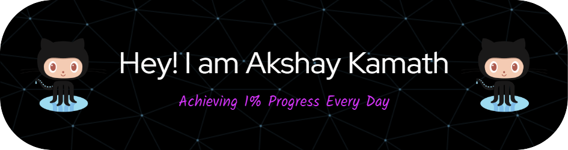

<!-- <h1 align="center">Hi 👋, I'm Akshay Kamath</h1>
<h3 >A Passionate Student,Exploring Different Domains in Tech</h3> -->

<!--  

  

 -->
 
 
  

  

  

<!-- 
  

  
  -->

<!--## 🏆 GitHub Trophies
-->

<!-- 
  
 -->

- 🎓 **Second Year Computer Engineering Student at Dwarkadas J. Sanghvi College of Engineering**.
- 🔭 I’m currently working on **Full Stack Web Development**
- 🌱 I’m currently learning **Backend Development - Node and App Development(Using Flutter)**
- 👯 I’m looking to collaborate on **Open Source , Flutter , and Web Development Projects** 
- 📫 How to reach me **akshaykamath193@gmail.com**
- 👨‍💻 All of my projects are available [here](https://akshaykamath.netlify.app/projects.html)

<!-- 
 <h3>Profile Views :-</h3>  

 -->

<h3 align="left"> Connect with me 🤝</h3>

<!--  -->

  <!-- 
 

 -->

<h3 align="left">Languages and Tools:</h3>

              

<!--

 
 -->

<h1 align="center"> GitHub Stats 📊 </h1>

<!-- 
&nbsp;
 -->

<!-- 
 
 -->
<!-- 

  
   -->
<!--   
   -->
  

   
  

  
<!--  -->
  

  
<!--    -->

  
  
  

 
 <!-- 

  <a href="https://github.com/akshaykamath45/github-readme-stats">
    

  
  
  

  

 -->
<h1 align="center">  Contributions ✨</h1>

 
  
  
  
  <!--
  -->
  
 
  
<!--       -->
<!--     -->
   
<!--    -->
<!--   The snake's are eating up my contributions🐍.

   -->

 

<h1 align="center">Random Dev Quote ✍️ </h1>

  
<!--  -->

  

  
 

<!-- The snake's eating up my contributions🐍.

  
    

  -->
